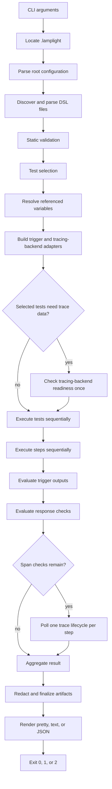

# Architecture

This document explains how Lamplight is organized, how a command becomes a
test run, and where contributors should make changes. The normative public
language contract is the [DSL and CLI reference](reference.md).

## Design goals

Lamplight is deliberately a single-process, local-first tool. Its core goals
are:

- deterministic test discovery and selection;
- strict validation before performing network operations;
- sequential trigger execution with explicit data flow between steps;
- W3C trace-context correlation without a control-plane service;
- bounded polling of direct-query and embedded-OTLP tracing backends;
- one PromQL contract over remote Prometheus, periodic scrape, and OTLP push;
- stable, machine-readable results and redacted local artifacts;
- interfaces at I/O boundaries so behavior can be tested without networks or
  wall-clock delays.

The current implementation has no daemon, database, queue, web UI, plugin
runtime, or remote state. A CLI invocation owns the complete lifecycle.

## Runtime flow



This ordering is an architectural contract. In particular, discovery and
static validation happen before runtime variable evaluation; selection happens
before required-variable checks; and failed response conditions prevent trace
polling for that step.

## Execution hierarchy and state

A run contains selected tests, each test contains ordered steps, and each step
contains one trigger followed by outputs and checks. The current trigger type is
`http_request`; the product model is not intended to be limited to HTTP.

- Tests run in deterministic selection order.
- Steps run in source order.
- A failed check marks the step and test `failed`; later steps in that test are
  `skipped`, but the next selected test can run.
- A technical error or cancellation stops the entire run. Remaining work is
  represented as `skipped` or `cancelled`.
- Step outputs enter the `steps` namespace only after their step completes.
- Test-level outputs are parsed and validated but are reserved in the current
  runtime; they are not evaluated or emitted.

The status vocabulary is centralized in `internal/model`: `passed`, `failed`,
`error`, `cancelled`, and `skipped`. Aggregation in `internal/result` maps those
states to the CLI exit-code contract.

## Static and runtime models

The loader produces `model.ProjectDefinition`. Expressions remain as HCL AST
nodes so they can be validated in their allowed context without requiring
runtime values.

After selection, `runtimevars` resolves only the variable closure required by
the selected tests and datasource. The CLI then constructs `model.Project`,
which combines the static definition, resolved sensitive values, selected
tests, evaluated HTTP client settings, and an optional datasource client.

This separation prevents `validate` and `list tests` from needing credentials
or network access and prevents unrelated tests from making a selected run
require unused variables.

## Trace lifecycle

When a tracing backend is configured, every trigger step receives a newly
generated W3C trace context. Triggers carry it in `traceparent` and identify
Lamplight-owned traces with `tracestate: lamplight=true`; user-provided
`traceparent` and `tracestate` headers are removed before injection so the
execution ID is authoritative. The system under test must propagate that
context and export spans using the same trace ID.

All span checks in one step share a single poller lifecycle. Direct adapters
normalize provider responses into `model.Span`; collector-backed providers
share an embedded OTLP/HTTP receiver and in-memory trace store. The poller evaluates
all predicates over each observation. Positive minimum checks may complete as
soon as their threshold is reached. Negative or exact checks require trace
completion, stability, an exceeded bound, or the observation deadline. See
[Tempo integration](tempo.md) for operational details.

## Package map

| Path | Responsibility |
| --- | --- |
| `cmd/lamplight` | Process entry point, signal-aware root context, and exit code. |
| `internal/cli` | Command parsing, dependency assembly, selection, rendering, and top-level error handling. |
| `internal/config` | Configuration path resolution and project defaults. |
| `internal/discovery` | Deterministic recursive discovery of Lamplight DSL files. |
| `internal/hclloader` | HCL decoding, duplicate detection, source diagnostics, and context-aware static validation. |
| `internal/runtimevars` | Selected-variable closure, precedence, type conversion, and sensitive-value tracking. |
| `internal/expr` | HCL evaluation contexts, pure function table, and cty conversion helpers. |
| `internal/model` | Shared definitions, runtime values, result types, statuses, and boundary interfaces. |
| `internal/selection` | Name/tag selection and stable ordering. |
| `internal/engine` | Run/test/step state machine and orchestration of HTTP, outputs, and checks. |
| `internal/httpstep` | Bounded HTTP execution, redirects, proxy/TLS settings, response decoding, and trace-header injection. |
| `internal/tracecontext` | Cryptographically random W3C trace and span identifiers. |
| `internal/checks` | Response assertion evaluation helpers. |
| `internal/datasource` | Backend registry and adapter construction. |
| `internal/datasource/tempo` | Tempo readiness, trace fetch, and OTLP JSON normalization. |
| `internal/datasource/jaeger` | Jaeger query API and JSON normalization. |
| `internal/datasource/search` | Elastic APM and OpenSearch query/normalization. |
| `internal/datasource/signalfx` | Splunk Observability trace-segment query/normalization. |
| `internal/datasource/otlp` | Embedded OTLP/HTTP receiver for traces and metrics. |
| `internal/promqlstore` | Bounded in-memory time series and embedded Prometheus PromQL evaluation. |
| `internal/metricssource/prometheus` | Remote Prometheus query API and periodic exposition scraping. |
| `internal/metricpoller` | Pre/post PromQL comparison and metric assertion lifecycle. |
| `internal/datasource/fake.go` | Scriptable datasource used by tests. |
| `internal/poller` | Deterministic trace-observation state machine and quantity-rule evaluation. |
| `internal/executorproto` | Versioned stdio RPC for remote trigger and datasource operations. |
| `internal/targetruntime` | Docker Compose and Kubernetes executor lifecycle adapters. |
| `internal/result` | Run aggregation, JSON v1 encoding, and recursive secret redaction. |
| `internal/artifact` | Atomic, permission-restricted snapshots and retention policy. |
| `internal/render` | Pretty, deterministic text, and JSON presentation. |
| `internal/diagnostic` | Stable diagnostic construction and source-location utilities. |
| `internal/initcmd` | Non-destructive starter project generation. |
| `schemas` | Versioned public JSON result schemas. |

Because packages under `internal` are not public Go APIs, external consumers
should integrate through the CLI, Lamplight DSL, JSON output, and schemas.

## Boundary interfaces

`internal/model/interfaces.go` defines the replaceable boundaries:

| Interface | Role |
| --- | --- |
| `StaticLoader` | Load a project definition and HCL diagnostics. |
| `RuntimeResolver` | Resolve runtime values for a selected definition. |
| `HTTPExecutor` | Perform one evaluated HTTP request. |
| `TriggerExecutor` | Perform one evaluated backend trigger. |
| `ExpressionEvaluator` | Evaluate one HCL expression in an explicit context. |
| `DataStore` | Check connectivity and observe a trace by ID. |
| `MetricStore` | Evaluate one instant PromQL query and return normalized result series. |
| `TraceContextFactory` | Generate an independent trace context. |
| `ArtifactStore` | Persist and finalize run snapshots. |
| `Renderer` | Encode a run result for users or automation. |
| `Clock` | Supply time and timers to deterministic polling tests. |

Keep business state in `model` values and pass effects through these
boundaries. Avoid importing CLI concerns into lower-level packages.

For non-local targets, the engine remains in the CLI and replaces its
`HTTPExecutor`, `TriggerExecutor`, and `DataStore` implementations with one
stdio protocol client. The ephemeral target process owns only network effects;
it never receives project files or evaluates tests and checks.

## Dependency direction

The intended dependency direction is:

```text
cmd -> cli -> orchestration and adapters -> model
                    |                    -> expr
                    +-> result/render/artifact
```

`model` must remain independent of concrete transports. The engine depends on
interfaces rather than Tempo or `net/http`. Adapters may depend on `model`, but
the model must not depend on adapters. This makes fake HTTP executors,
datasources, clocks, and trace factories sufficient for most tests.

## Public compatibility surfaces

Changes to any of these surfaces require documentation, tests, and an explicit
compatibility decision:

1. DSL blocks, attributes, expression contexts, or functions.
2. Command names, flags, output formats, and exit codes.
3. Result JSON and `schemas/run-result-v1.schema.json`.
4. Artifact names, retention, permissions, and redaction guarantees.
5. Backend request paths, accepted payload forms, and retry semantics.

An internal refactor that preserves those contracts does not require a schema
version change. A breaking JSON change does. Additive DSL changes should still
be documented as public behavior rather than relying on parser internals.

## Adding functionality

For a new HCL property or block:

1. Add the static definition to `internal/model`.
2. Decode and validate it in `internal/hclloader`, including duplicate,
   unknown, type, range, and allowed-context diagnostics.
3. Include its expressions in runtime variable dependency collection.
4. Evaluate it in the narrowest possible runtime context.
5. Add loader, runtime, failure, redaction, and renderer tests as applicable.
6. Update `docs/reference.md` and every affected example.

For a new tracing datasource, implement `model.DataStore` and keep normalization inside
the adapter. The poller and engine should consume normalized spans and remain
backend-independent.

For a metrics source, implement `model.MetricStore`. Remote Prometheus sources
may delegate queries to `/api/v1/query`; pull and push sources append samples
to `internal/promqlstore` and evaluate the same PromQL contract locally.

For a new output field, update `model`, aggregation/redaction, renderers,
artifacts, the JSON schema, compatibility tests, and the reference together.

## Testing strategy

Unit and integration-style package tests use local HTTP servers and fakes; they
must not require a live Tempo instance. Inject `model.Clock` into polling tests
instead of sleeping. Keep network-specific parsing fixtures in the relevant
adapter package.

The required contributor checks are documented in
[`CONTRIBUTING.md`](../CONTRIBUTING.md). A manual live-Tempo smoke test is
valuable for adapter changes but supplements rather than replaces automated
coverage.

## Security boundaries

Sensitive variables are tagged at resolution time and their string forms feed
the recursive redactor used for terminal results and artifacts. Artifacts use
per-run directories with mode `0700` and files with mode `0600`.

Redaction is a defense in depth, not permission to commit secrets. New output
paths must use the central redactor, diagnostics must avoid embedding secret
values, TLS verification must default to enabled, and examples must use
placeholders or environment variables.
